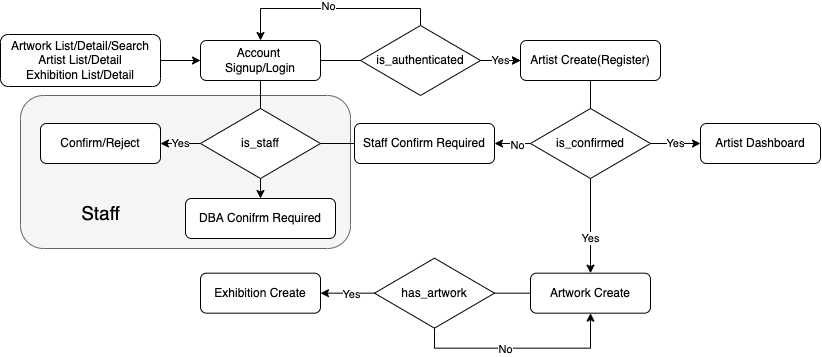
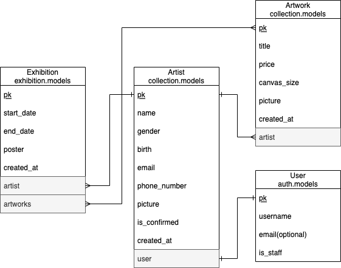

# 오픈 갤러리 | 개발자 과제

> 최명규 gyumyeong@khu.ac.kr 010 4085 0733

> Deployment : https://og-assignment.herokuapp.com

----------

# 앱 구조

```

├── dashboard
│   ├── staff(작품/전시회/작가현황, 작가통계, 작가 신청 승인/거절)
│   └── artist(프로필/나의 작품/나의 전시회)
│
├── collection
│   ├── artist(작가 목록/상세)
│   └── artwork(작품 목록/상세/검색)
│ 
└──exhibition(전시회 목록/상세)

```

----------

# 권한 및 계정

| 구분                | 작품/작가/전시회 현황 | 작가 신청 | 작품/전시회 등록 | 대시보드 | 
|-------------------|-------------|-------|-----------|------|
| Client            | O           | X     | X         | X    |
| Client(Signup)    | O           | O     | X         | X    |
| Artist            | O           | X     | X         | O    |
| Artist(Confirmed) | O           | X     | O         | O    |
| Staff             | O           | X     | X         | O    |

### 계정 목록(아이디/비밀번호)

- staff / staff12341234
- artist1 / artist12341234
- artist2 / artist12341234
- artist3 / artist12341234
- artist4 / artist12341234

----------

# 주요 로직



----------

# 데이터베이스 스키마



- 작가의 경우 Artist 모델을 새로 정의해 User 모델과 1:1 관계로 설정하였습니다.
- 날짜가 겹치지 않는 다면 작품과 전시회의 다대다 관계가 성립한다고 판단되어 Artwork과 Exhibition 모델을 N:M
  관계로 설정했습니다.

----------

# 기술 명세서

## 고객 페이지

### 로그인/회원가입 페이지

- 회원가입과 로그인은 django의 내장 로직과 템플릿을 그대로 활용하였습니다.
- 회원가입과 작가등록 신청은 구분되며, 관리자 계정(staff)은 개발자 및 DBA가 User 모델의 is_staff를 True로 설정함에 따라 권한이 부여됩니다.

### 작품 목록 조회 페이지

- 작품 목록 조회 페이지는 스택 카드 형식으로 UI/UX를 구현했으며 작품 제목, 호수, 가격, 작가 등으로 작품 검색 기능을 도입했습니다.

### 작가 목록 조회 페이지

- 작가 목록 조회 페이지는 스택 카드 형식으로 UI/UX를 구현했습니다. 작가 검색 기능은 생략했습니다.

### 작가 등록 신청 페이지

- 작가 등록은 회원가입 이후 신청할 수 있으며 로그인 하지 않은 상태에서는 관련 로직이
  로그인/회원가입으로 redirect되도록 구현했습니다. 작가 등록 신청 후 승인 대기 상태에서 추후 관리자가 승인/반려를 처리합니다.
-
- 이름/성별/생년월일/이메일은 django.models/forms에 내장된 유효성 검사를 활용하였으며, 연락처(000-0000-0000)의
  유효성 검사는 정규식을 활용했습니다.

## 관리자 페이지

### 대시보드 페이지

- 관리자 대시보드 페이지는 전체 작품/작가(통계)/전시회 현황 테이블 페이지와 작가등록신청 승인/반려 페이지로 구성했습니다.

### 작가 등록 신청 내역 조회 페이지

- 작가 등록 신청 내역 페이지는 대기->승인->반려 순서로 작가 목록을 테이블 형식으로 보여주며 최근 신청된 순서로 정렬되어 있습니다.
- 체크 박스를 이용하여 대기에 놓여 있는 작가에 대해서만 승인/반려 일괄 처리가 가능합니다.
- CSV 다운로드 기능은 생략했습니다.

### 작가 통계 페이지

- 작가 통계 페이지에서는 django.db의 aggregation과 annotation을 활용하여
  Artist 모델의 각 필드와 작품수/100호 이하 작품수/최저가격/최고가격/평균가격/총가격을 테이블 형식으로 구현했습니다.

## 작가 페이지

### 대시보드 페이지

- 작가 대시보드 페이지에서는 작가 프로필과 나의작품/전시회 현황 조회가 가능합니다.

### 작품 등록 페이지

- 작품 등록은 승인된 작가에 한 에서만 가능하도록 구현했습니다.
- 제목/가격/호수의 유효성 검사는 django.models/forms에 내장된 기능을 활용하였으며, 가격의 경우 스크립트를 사용하여
  천단위마다 구분자가 자동으로 입력되도록 구현했습니다.

### 전시 등록 페이지

- 전시 등록은 승인된 작가가 한 개 이상의 작품을 등록 했을때 가능합니다.
- 제목/시작일/종료일/작품목록은 django.models/forms에 내장된 기능을 활용하였으며, **특히 종료일이 시작일보다 빠를 수 없도록 유효성 검사를 추가했습니다.**


